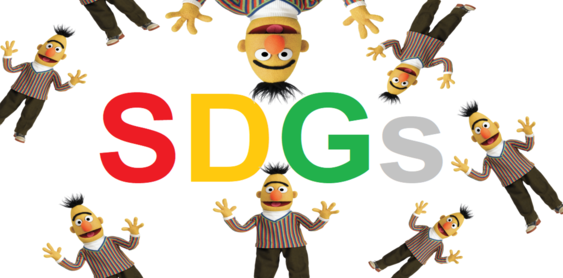

# SDGs many BERTs
Train multiple [mBERT](https://huggingface.co/bert-base-multilingual-uncased) models for binary classification and deploy them for multiclass-multilabel classification. The _train_multilabel_models_ scirpt uses as many models as there are classes in a training set. It overcomes a problem of imbalanced classes in multiclass-multilabel classificaiton by slicing the training data into smaller sets based on individual classes in the following manner: select all instances belonging to class 1; select randomly from the remaining classes the same number of instances as in class 1 to represent class 0. The scrips were written to classify SDG targets.

Apart from this script, there is also the _train_multilabel_model_ script that is intended for training one multilabale model (17 independent probabilities as output) and _train_multiclass_model_ script that we used for training on Elsevier data (16 dependent probabilities as output, since SDG 17 in not present in this training data).

#### Requirements
Tensorflow 2.4.0, Transformers 4.5.0, NLTK 3.6.1, si-kit learn 0.24.1, Pandas, glob, time

## Background
These scripts were written within [Work Package 5.1](https://alliance.aurora-network.global/work-packages/aurora-sdg-research-dashboard) of the [Aurora Alliance](https://alliance.aurora-network.global/).

### Sustainable Development Goals (SDGs)
The Sustainable Development Goals (SDGs), also known as the Global Goals, were adopted by the United Nations in 2015 as a universal call to action to end poverty, protect the planet, and ensure that by 2030 all people enjoy peace and prosperity. [[1]](#1) There are 17 SDGs in total and each of them has several targets and indicators; full list of them could be found for example [here](https://sdg.humanrights.dk/en/goals-and-targets).

| No. | SDG | Num. of targets | No. | SDG | Num. of targets |
| --- | --- | --- | --- | --- | --- |
| 1 | No Poverty | 7 | 10 | Reducing Inequality | 10 |
| 2 | Zero Hunger | 8 | 11 | Sustainable Cities and Communities | 10 |
| 3 | Good Health and Well-being | 13 | 12 | Responsible Consumption and Production | 11 |
| 4 | Quality Education | 10 | 13 | Climate Action | 5 |
| 5 | Gender Equality | 9 | 14 | Life Below Water | 10 |
| 6 | Clean Water and Sanitation | 8 | 15 | Life On Land | 12 |
| 7 | Affordable and Clean Energy | 5 | 16 | Peace, Justice, and Strong Institutions | 12 |
| 8 | Decent Work and Economic Growth | 12 | 17 | Partnerships for the Goals | 19 |
| 9 | Industry, Innovation and Infrastructure | 8 | | | |

### The Aurora Alliance
The Aurora Alliance equips European Universities to provide a diverse student population with the skills and mindset needed to contribute to addressing societal challenges as social entrepreneurs and innovators. The Aurora Alliance shares it’s mission with the Aurora Universities Network. Originally formed in 2016, Aurora is a consortium of research intensive universities deeply committed to the social impact of their activities. [[2]](#2)

**References**  
<a id="1">[1]</a> [UNDP](https://www.undp.org/sustainable-development-goals)  
<a id="2">[2]</a> [The Aurora Alliance](https://alliance.aurora-network.global) 
